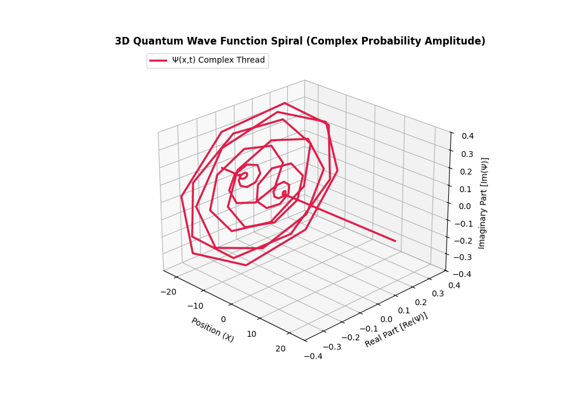

# Griffiths Quantum Mechanics Self-Study

Handwritten archives, rigorous mathematical derivations, and conceptual text summaries from an independent study of David J. Griffiths' *Introduction to Quantum Mechanics*.

## 📌 Repository Architecture & Navigation

This repository functions as a verifiable, machine-readable ledger documenting advanced academic progression through quantum mechanics. The repository is organized hierarchically by artifact type:

*   **`/derivations/`**: Pure math LaTeX source files proving foundational theorems from absolute scratch.
*   **`/summaries/`**: Theoretical summaries and conceptual breakdowns mapping physical insights.
*   **`/archives/`**: Full chronological scans of handwritten notebook proofs across 5 targeted chapters.

---

## 📐 Top-Tier Mathematical Derivations (\LaTeX)

The following source files contain complete, non-abbreviated analytical derivations:

*   **Chapter 1: The Wave Function**
    *   [`ch1_probability_conservation.tex`](Wave_function_normalisation.pdf): Explicit derivation of $\frac{d}{dt} \int_{-\infty}^{\infty} |\Psi(x,t)|^2 dx = 0$ invoking the time-dependent Schrödinger equation and integration by parts.
*   **Chapter 2: The Time-Independent Schrödinger Equation**
    *   [`ch2_infinite_square_well.tex`](./derivations/ch2_infinite_square_well.tex): Calculation of boundary condition matching, normalization constants ($A = \sqrt{2/a}$), and energy eigenvalues ($E_n = \frac{n^2\pi^2\hbar^2}{2ma^2}$).

---

## 📖 Chapter summaries & Theoretical Frameworks

*   **Chapter 1**: Physical interpretation of the wave function, statistical variance, and expectation values $\langle x \rangle$ and $\langle p \rangle$.
*   **Chapter 2**: Stationary states, orthogonality, completeness, and algebraic ladder operator methods for the Harmonic Oscillator.
*   **Chapter 3**: Formalism – Hilbert space, Hermitian operators, Dirac notation, and generalized statistical interpretation.
*   **Chapter 4**: Quantum Mechanics in Three Dimensions – Spherical coordinates, angular momentum, and the Hydrogen atom.
*   **Chapter 5**: Identical Particles – Two-particle systems, bosons and fermions, and the Pauli exclusion principle.

---

## 🗄 Handwritten Notes Archive

- **Chapter 1 Notes (Pages 1–10):**
-  - [View Page Group 1](./page1ch.1.jpg)
    - [View Page Group 2](./page2.ch1.jpg)
    - [View Page Group 3](./page3ch1.jpg)
    - [View Page Group 4](./page4ch1.jpg)
    - [View Page Group 5](./page5ch1.jpg)
    - [View Page Group 6](./page6ch1.jpg)
    - [View Page Group 7](./page7ch1.jpg)
    - [View Page Group 8](./page8ch1.jpg)
    - [View Page Group 9](./page9ch1.jpg)
    - [View Page Group 10](./page10ch1.jpg)

-- **Chapter 2 Notes (Pages 1–35):**
[gaussian wave packet](swirling_wave_packet)
 - [View Page Group 1](./page1ch2.jpg)
 - [View Page Group 2](./page2ch2.jpg)
 - [View Page Group 3](./page3ch2.jpg)
 - [View Page Group 4](./page4ch2.jpg)
 - [View Page Group 5](./page5ch2.jpg)
 - [View Page Group 6](./page6ch2.jpg)
 - [View Page Group 7](./page7ch2.jpg)
 - [View Page Group 8](./page8ch2.jpg)
 - [View Page Group 9](./page9ch2.jpg)
 - [View Page Group 10](./page10ch2.jpg)
 - [View Page Group 11](./page11ch2.jpg)
 - [View Page Group 12](./page12ch2.jpg)
 - [View Page Group 13](./page13ch2.jpg)
 - [View Page Group 14](./page14ch2.jpg)
 - [View Page Group 15](./page15ch2.jpg)
 - [View Page Group 16](./page16ch2.jpg)
 - [View Page Group 17](./page17ch2.jpg)
 - [View Page Group 18](./page18ch2.jpg)
 - [View Page Group 19](./page19ch2.jpg)
 - [View Page Group 20](./page20ch2.jpg)
 - [View Page Group 21](./page21ch2.jpg)
 - [View Page Group 22](./page22ch2.jpg)
 - [View Page Group 23](./page23ch2.jpg)
 - [View Page Group 24](./page24ch2.jpg)
 - [View Page Group 25](./page25ch2.jpg)
 - [View Page Group 26](./page26ch2.jpg)
 - [View Page Group 27](./page27ch2.jpg)
 - [View Page Group 28](./page28ch2.jpg)
 - [View Page Group 29](./page29ch2.jpg)
 - [View Page Group 30](./page30ch2.jpg)
 - [View Page Group 31](./page31ch2.jpg)
 - [View Page Group 32](./page32ch2.jpg)
 - [View Page Group 33](./page33ch2.jpg)
 - [View Page Group 34](./page34ch2.jpg)
 - [View Page Group 35](./page35ch2.jpg)
 - 

---

## 🛠️ Progression Ledger

- [x] **Chapter 1: The Wave Function** (Derivations typeset, handwritten logs archived)
- [x] **Chapter 2: Time-Independent Schrödinger Equation** (handwritten logs archived)
- [ ] **Chapter 3: Formalism** (Reading phase)
- [ ] **Chapter 4: Quantum Mechanics in 3D** (Planned)
- [ ] **Chapter 5: Identical Particles** (Planned)

